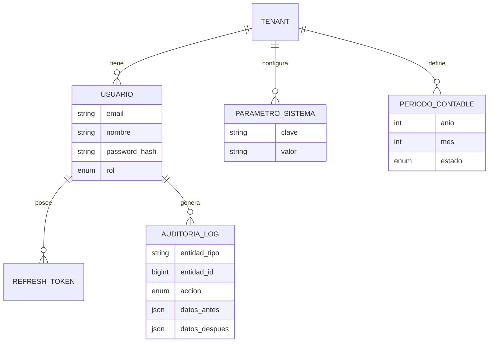
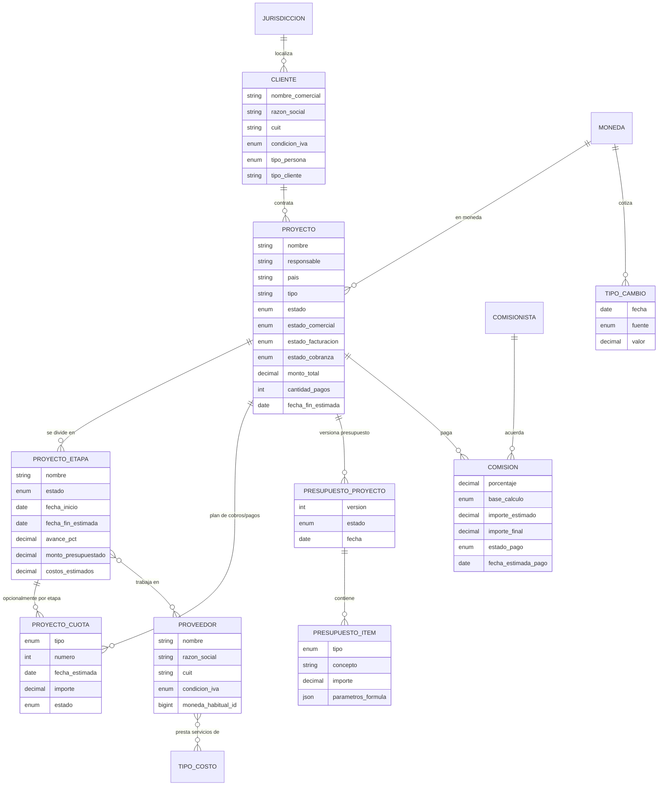
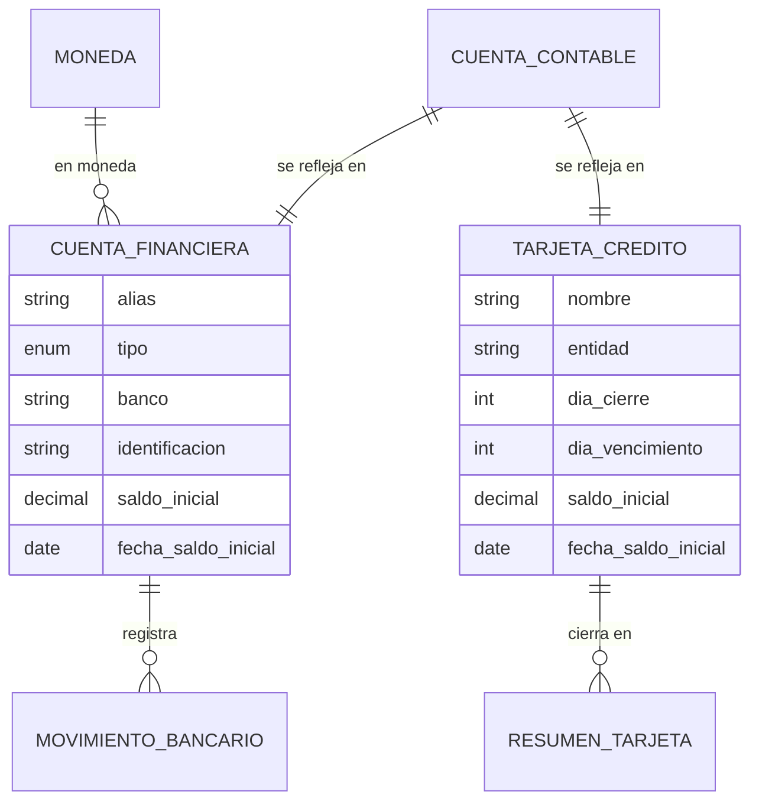
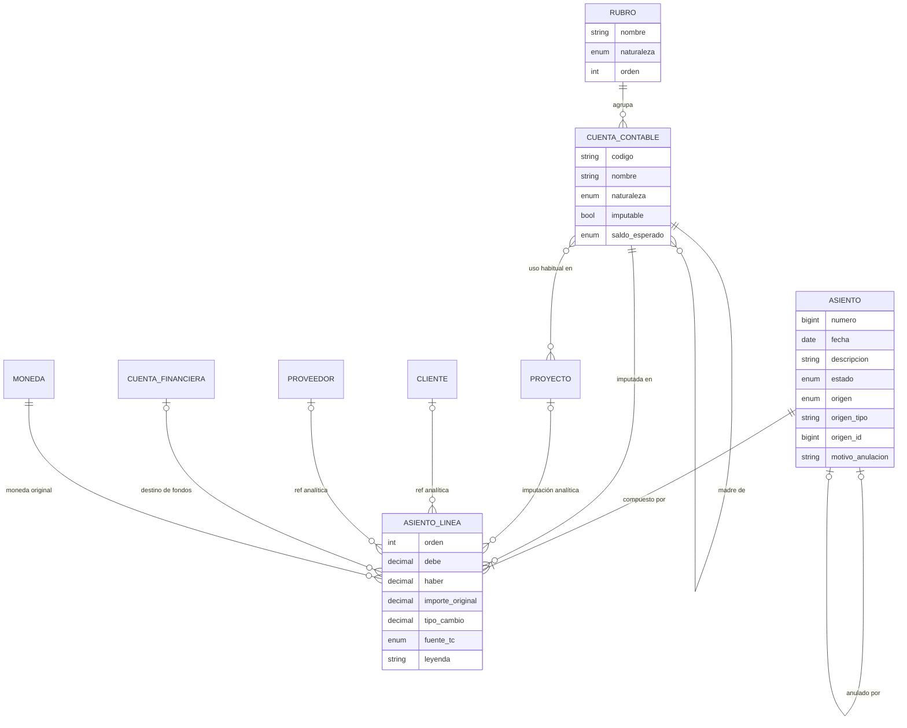
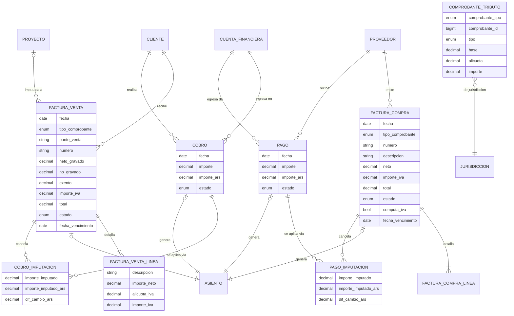
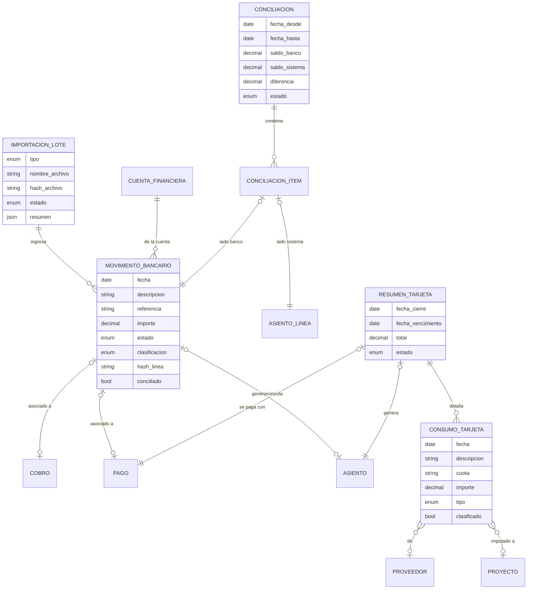
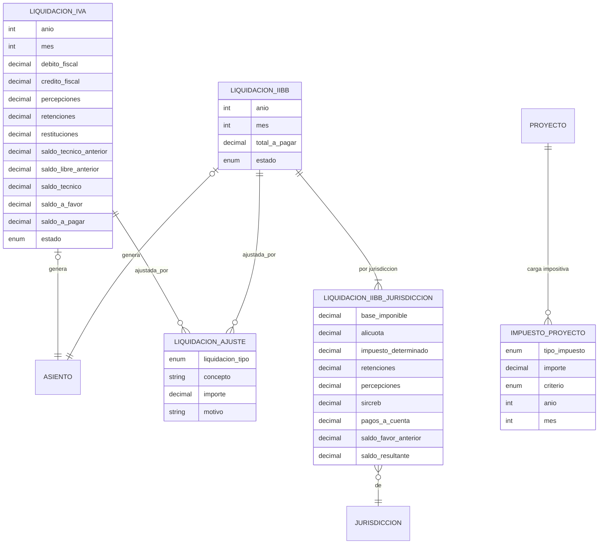
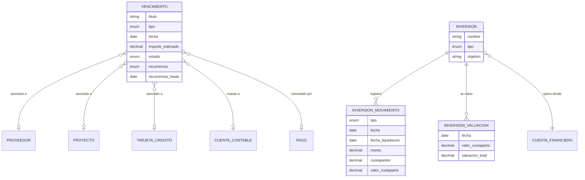
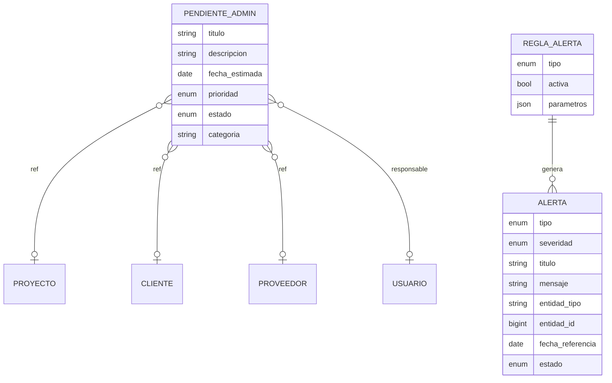

# [F1.1] Arquitectura global y modelo de datos contable

> **Estado:** pendiente de checkpoint humano (equipo + contador).
> **Modelo ejecutor:** Claude Fable 5.
> **Entradas usadas:** `inputs/brief_proyecto.md`, `inputs/documento_funcional.md` (secciones 1–19), `plan/00_plantillas.md`.
> **Alcance:** solo diseño. No incluye código. Las decisiones de tooling (Maven/Gradle, biblioteca UI, mono/multi-repo) se toman en F1.2.

---

## 1. Visión de arquitectura

**Monolito modular** (un solo deployable Spring Boot) organizado **por dominio funcional** (package-by-feature), no por capa técnica. Justificación: un solo equipo, un solo tenant activo, dominios fuertemente acoplados por el asiento contable; microservicios agregarían costo sin beneficio. La modularidad interna (paquetes con fronteras claras + eventos de dominio internos) deja abierta la evolución a SaaS.

```
com.montanaritech.contable
├── config/            # Spring config, seguridad, OpenAPI, CORS, Jackson, TZ
├── common/            # compartido transversal
│   ├── api/           #   paginación, filtros estándar, respuestas, ProblemDetail
│   ├── error/         #   excepciones de negocio + catálogo de códigos + @RestControllerAdvice
│   ├── money/         #   ImporteMonetario (embeddable), redondeo, conversión
│   ├── tenant/        #   TenantContext, filtro Hibernate, interceptor
│   ├── audit/         #   AuditService, entidad AuditoriaLog, listeners de timestamps
│   ├── periodo/       #   PeriodoGuard (validación de período cerrado)
│   ├── secuencia/     #   SecuenciaService (numeración interna por tenant)
│   └── adjunto/       #   almacenamiento de archivos adjuntos genérico
├── auth/              # usuarios, roles, JWT, refresh tokens
├── maestros/
│   ├── cliente/  proveedor/  comisionista/
│   ├── proyecto/      # proyecto, etapa, cuotas, presupuesto estimado
│   ├── moneda/        # moneda + tipo de cambio
│   ├── jurisdiccion/  # jurisdicciones IIBB + alícuotas
│   ├── clasificacion/ # rubros, tipos de costo, conceptos recurrentes
│   └── cuentafinanciera/  # cuentas banco/dinero/MP + tarjetas (maestro)
├── contabilidad/      # plan de cuentas, asientos, mayores, períodos
├── facturacion/       # facturas venta/compra, cobros, pagos, imputaciones
├── bancos/            # movimientos, importaciones, conciliación, resúmenes tarjeta
├── impuestos/         # liquidaciones IVA e IIBB, ajustes, impuesto-proyecto
├── planificacion/     # vencimientos, presupuesto de pagos, inversiones
├── pendientes/        # pendientes administrativos
├── alertas/           # motor de alertas + reglas
├── reportes/          # servicios de agregación + ReportExportService (POI/OpenPDF)
├── busqueda/          # Lupita
└── importacion/       # lotes de importación, parsers (Galicia/MP/tarjeta/Excel)
```

### 1.1 Capas dentro de cada módulo

`Controller → Service → Repository`, con reglas estrictas:

- **Controller**: solo HTTP. Recibe/devuelve DTOs, valida con Bean Validation, delega. Sin lógica de negocio. Sin entidades JPA en la firma.
- **Service**: dueño de la transacción (`@Transactional` a nivel método público) y de TODAS las reglas de negocio (balanceo, estados, período cerrado, imputabilidad). Un service no toca repositorios de otro módulo: invoca al service del otro módulo.
- **Repository**: Spring Data JPA. Queries derivadas o `@Query`; agregaciones de reportes con proyecciones DTO (nunca cargar entidades enteras para sumar).
- **DTOs**: `XxxRequest` / `XxxResponse` por operación; MapStruct para mapear. Las entidades JPA jamás salen del service.
- **Eventos internos**: hechos contables cruzados entre módulos (ej.: "factura confirmada" → generar asiento) se resuelven con llamada directa sincrónica **dentro de la misma transacción** (la contabilidad no puede quedar eventual-consistente). Los efectos no contables (alertas) sí pueden usar `@TransactionalEventListener(AFTER_COMMIT)`.

### 1.2 Convenciones de nombres

| Elemento | Convención | Ejemplo |
|---|---|---|
| Tablas | `snake_case`, singular, español | `factura_venta`, `asiento_linea` |
| Columnas | `snake_case` | `fecha_saldo_inicial` |
| FK | `<entidad>_id` | `cliente_id` |
| UK/IX | `uk_`/`ix_` + tabla + columnas | `uk_asiento_tenant_numero` |
| Entidades Java | PascalCase español | `FacturaVenta` |
| Endpoints | `/api/v1/<recurso-plural-kebab>` | `/api/v1/facturas-venta` |
| Migraciones Flyway | `V<seq>__<modulo>_<descripcion>.sql` | `V012__contabilidad_asientos.sql` |
| Enums | JPA `@Enumerated(STRING)`, valores en MAYÚSCULA_ESPAÑOL | `CONFIRMADO` |

### 1.3 Manejo de errores

- Respuestas de error en formato **RFC 7807 (`ProblemDetail`)** vía `@RestControllerAdvice` global, con extensión `codigo` (catálogo estable de códigos de negocio) y `detalles` (lista campo→mensaje para validación).
- Jerarquía de excepciones: `NegocioException` (422 — regla violada, ej. `ASIENTO_NO_BALANCEA`), `RecursoNoEncontradoException` (404), `ConflictoException` (409 — ej. borrado con movimientos asociados, edición concurrente), `PeriodoCerradoException` (422, código `PERIODO_CERRADO`), `AccesoDenegadoException` (403).
- Códigos de negocio del núcleo (catálogo inicial, extensible): `ASIENTO_NO_BALANCEA`, `CUENTA_NO_IMPUTABLE`, `ESTADO_INVALIDO`, `PERIODO_CERRADO`, `TIENE_MOVIMIENTOS_ASOCIADOS`, `TC_FALTANTE`, `IMPORTACION_DUPLICADA`, `NUMERO_COMPROBANTE_DUPLICADO`.
- Lock optimista (`@Version`) en documentos y asientos → `409` con código `CONFLICTO_CONCURRENCIA`.

### 1.4 Transversales técnicos

- **Fechas**: fechas contables/operativas como `DATE` (`LocalDate`); timestamps técnicos como `DATETIME(6)` en UTC (`Instant`); zona de negocio `America/Argentina/Buenos_Aires` centralizada en config (usada para "hoy", vencimientos, períodos).
- **MySQL**: InnoDB, `utf8mb4` / `utf8mb4_0900_ai_ci`. FKs reales siempre. `DECIMAL` para todo importe.
- **Precisión**: importes `DECIMAL(18,2)`; tipos de cambio `DECIMAL(18,6)`; porcentajes/alícuotas `DECIMAL(9,6)`; cuotapartes y su valor `DECIMAL(18,6)`. En Java, `BigDecimal` con `RoundingMode.HALF_UP` centralizado en `common/money`.
- **IDs**: `BIGINT AUTO_INCREMENT`. No UUID (sistema interno, simplicidad, índices compactos).
- **Actuator**: `/actuator/health` y `/actuator/info` públicos internos; resto protegido.

---

## 2. Estrategia multi-tenant-ready

- Tabla `tenant` con la fila 1 = Montanari Tech (seed Flyway).
- **Toda entidad de negocio** lleva `tenant_id BIGINT NOT NULL` con FK a `tenant` e incluida en todo UK de negocio (ej. `uk(tenant_id, codigo)` en plan de cuentas).
- **Filtrado**: `@FilterDef`/`@Filter` de Hibernate (`tenant_id = :tenantId`) declarado en una `@MappedSuperclass` común (`EntidadNegocio`), habilitado en cada request por un interceptor que lee el tenant del JWT (claim `tenant`; hoy siempre 1). La asignación en el INSERT la hace un `@PrePersist` desde `TenantContext`.
- **Nada de multiempresa en UI ni endpoints**: no existe selector de empresa; el tenant es invisible.
- Excepciones (tablas sin tenant): `tenant`, `moneda` (catálogo global ISO). Todo lo demás, incluida auditoría, usuarios y parámetros, es por tenant.

`EntidadNegocio` (mapped superclass) define: `id`, `tenant_id`, `creado_en`, `creado_por`, `actualizado_en`, `actualizado_por`, `version` (lock optimista). Los maestros agregan `activo BOOLEAN` (soft-delete PL-1); los documentos usan estado PL-5 en lugar de `activo`.

---

## 3. Tratamiento multimoneda (patrón central)

Regla de oro: **la contabilidad se lleva en ARS** (moneda de presentación). Toda cifra que impacta el libro diario está en ARS; la moneda original nunca se pierde.

Patrón embeddable `ImporteMonetario`, presente en toda operación con dinero:

| Campo | Tipo | Nota |
|---|---|---|
| `moneda_id` | FK moneda | moneda original de la operación |
| `importe_original` | DECIMAL(18,2) | en moneda original |
| `tipo_cambio` | DECIMAL(18,6) | 1.000000 si ARS |
| `fuente_tc` | ENUM `BNA_VENTA, BNA_COMPRA, OFICIAL, MANUAL, OTRO` | criterio usado |
| `importe_ars` | DECIMAL(18,2) | `importe_original × tipo_cambio`, redondeo HALF_UP |

- La tabla `tipo_cambio` guarda cotizaciones por (moneda, fecha, fuente); la fuente por defecto es un parámetro del sistema. El usuario siempre puede pisar el TC por operación (`fuente_tc = MANUAL`).
- Si falta TC para la fecha/fuente al confirmar una operación en moneda extranjera → error `TC_FALTANTE` (no se adivina).
- **Diferencias de cambio**: surgen al imputar un cobro/pago a una factura registrada a otro TC. La diferencia (en ARS) se materializa como **líneas adicionales del asiento del cobro/pago** contra las cuentas "Diferencia de cambio ganada / perdida" (rubro resultados financieros), y queda registrada en `cobro_imputacion.dif_cambio_ars` / `pago_imputacion.dif_cambio_ars` para el reporte por proyecto. La parametrización fina de la regla es de F4.1; este modelo la soporta por completo.
- Los mayores de cuentas en USD (ej. Banco Galicia USD) se leen en ARS como todo mayor, pero cada línea conserva `importe_original`/`moneda`, lo que permite la columna "evolución en moneda original".

---

## 4. Auditoría transversal

Tabla única `auditoria_log`, **solo-inserción** (nunca UPDATE/DELETE; sin `version`):

```
auditoria_log(id, tenant_id, entidad_tipo VARCHAR(60), entidad_id BIGINT,
              accion ENUM(CREAR, EDITAR, ELIMINAR, CONFIRMAR, ANULAR, DUPLICAR,
                          CERRAR_PERIODO, REABRIR_PERIODO, IMPORTAR, LOGIN,
                          CAMBIO_ESTADO, EXPORTAR_SENSIBLE),
              usuario_id, fecha_hora DATETIME(6),
              datos_antes JSON NULL, datos_despues JSON NULL,
              sobre_periodo_cerrado BOOLEAN DEFAULT FALSE,
              detalle VARCHAR(500) NULL)
IX: (tenant_id, entidad_tipo, entidad_id), (tenant_id, fecha_hora), (usuario_id)
```

- **Escritura sincrónica en la misma transacción** que la operación auditada (si falla la operación no queda log huérfano; si falla el log, falla la operación: en un sistema contable la trazabilidad es parte de la operación).
- La invoca explícitamente el service (`AuditService.registrar(...)`) en las operaciones sensibles listadas en el funcional §14.2. No se audita todo automáticamente: lo automático indiscriminado genera ruido y costo; la lista de operaciones sensibles es cerrada y conocida.
- `datos_antes/datos_despues`: snapshot JSON del DTO de la entidad (no de la entidad JPA), serializado con Jackson. Para confirmaciones/anulaciones alcanza el diff de estado + totales.
- `sobre_periodo_cerrado = TRUE` marca la **auditoría reforzada** de modificaciones admin sobre período cerrado (además `detalle` exige motivo no vacío).
- Timestamps `creado_*/actualizado_*` en cada tabla se completan por entity listener; son complemento, no reemplazo, del log.

---

## 5. Períodos contables y cierre

```
periodo_contable(id, tenant_id, anio SMALLINT, mes TINYINT,
                 estado ENUM(ABIERTO, CERRADO),
                 cerrado_por, cerrado_en, reabierto_por, reabierto_en,
                 UK(tenant_id, anio, mes))
```

Reglas (funcional §15):

1. El período de una operación se deriva de su **fecha contable** (año-mes). No hay FK `periodo_id` en asientos/documentos: se resuelve por fecha, lo que evita inconsistencias fecha↔período.
2. Los períodos se crean on-demand (al primer uso del mes) en estado `ABIERTO`. Pueden cerrarse solo por admin.
3. **El cierre solo restringe escritura**: crear/editar/confirmar/anular/eliminar operaciones cuya fecha cae en período cerrado. Nunca bloquea consultas, reportes, exportaciones, ni importaciones a bandeja de revisión (los movimientos importados no impactan contabilidad hasta confirmarse).
4. Escritura sobre período cerrado: requiere rol `ADMINISTRADOR` + motivo obligatorio + auditoría reforzada (`sobre_periodo_cerrado = TRUE`). Implementado en un único `PeriodoGuard` (`common/periodo`) invocado por los services de escritura contable — un solo punto de verdad para la regla.
5. Reapertura de período: admin, auditada. No hay estado "en revisión" en esta etapa (YAGNI; el enum es extensible).
6. La liquidación de IVA/IIBB confirmada de un mes **no exige** período cerrado, pero el cierre es la práctica recomendada post-liquidación (se documentará en F11.4).

---

## 6. Modelo de datos (DER)

Convención en los diagramas: se omiten `tenant_id`, `creado_*`, `actualizado_*`, `version` y `activo` (presentes según §2) para legibilidad. PK siempre `id BIGINT`. El diccionario completo de columnas está en §7.

### 6.1 Núcleo: seguridad, auditoría, parámetros



Roles: enum fijo `ADMINISTRADOR / CARGA / LECTURA` en la columna `usuario.rol` (no tabla de roles: los tres roles del funcional son estables; extensible a tabla si la etapa SaaS lo pide).

### 6.2 Maestros comerciales y proyectos



Notas de diseño:

- `proyecto_cuota` unifica "cobros previstos" (tipo `COBRO`, sin proveedor) y "pagos previstos a proveedores" (tipo `PAGO`, con `proveedor_id`), a nivel proyecto o etapa (`etapa_id` nullable). Alimenta calendario, flujo proyectado y comparación presupuesto vs. real.
- `presupuesto_proyecto` es **versionado** (`version`, estado `BORRADOR/VIGENTE/HISTORICO`; un solo `VIGENTE` por proyecto). El real nunca pisa el presupuesto: la comparación es por consulta.
- `presupuesto_item.tipo`: `INGRESO / COSTO_PROVEEDOR / IMPUESTO / COMISION / OTRO_GASTO`; con `tipo_costo_id` y `proveedor_id` opcionales, y `parametros_formula JSON` reservado para replicar la hoja de fórmulas del Excel (estructura definitiva en F2.6 cuando llegue la hoja — el modelo cabecera+ítems+JSON absorbe cualquier forma que tenga).
- `jurisdiccion` sirve a la vez de "provincia del cliente" y de jurisdicción IIBB (`es_jurisdiccion_iibb BOOLEAN`), con `jurisdiccion_alicuota` (actividad, alícuota, vigencia desde/hasta) para F6.2.

### 6.3 Cuentas financieras y tarjetas (maestro)



- `cuenta_financiera.tipo`: `BANCO / CAJA / MERCADO_PAGO / OTRA_CUENTA_DINERO`. Cada cuenta financiera y cada tarjeta apunta 1:1 a su **cuenta contable imputable** (rubro Caja y Bancos / Deudas Bancarias): así el mayor contable y el módulo de bancos siempre concilian por construcción.
- `saldo_inicial` + `fecha_saldo_inicial` son editables (funcional §6.2); contablemente se materializan en el **asiento de apertura** (F10.3), que se regenera si el admin los modifica antes del arranque productivo.

### 6.4 Contabilidad (núcleo)



Decisiones estructurales del núcleo (las finas quedan para F3.1, que las hereda):

- **`cuenta_contable`**: jerarquía por `padre_id` (adjacency list — profundidad esperada ≤ 5, recorridos con CTE recursivo de MySQL 8). `naturaleza ENUM(ACTIVO, PASIVO, PATRIMONIO_NETO, RESULTADO_POSITIVO, RESULTADO_NEGATIVO)` — las 5 grandes categorías son un enum fijo (definen el signo contable, no son configurables); lo configurable son **rubros** (tabla `rubro`, con naturaleza y orden de presentación) y cuentas. `UK(tenant_id, codigo)`. Invariantes de aplicación: una cuenta con hijas no puede ser imputable; no se puede desactivar/eliminar una cuenta con movimientos; la naturaleza de una hija debe coincidir con la de su madre.
- **`asiento`**: `numero` es **NULL en borrador** y se asigna correlativo por tenant al confirmar (vía `secuencia` con lock pesimista) — la numeración interna queda sin huecos por borradores descartados; los borradores se identifican por id técnico. `UK(tenant_id, numero)` (NULL permitido múltiple). `origen ENUM(MANUAL, FACTURA_VENTA, FACTURA_COMPRA, COBRO, PAGO, LIQUIDACION_IVA, LIQUIDACION_IIBB, RESUMEN_TARJETA, MOVIMIENTO_BANCARIO, APERTURA, AJUSTE, IMPORTACION)` + vínculo polimórfico `origen_tipo/origen_id` al documento generador (y el documento tiene su FK `asiento_id` — vínculo bidireccional PL-4).
- **`asiento_linea`**: `debe` y `haber` en **ARS**, con `CHECK (debe >= 0 AND haber >= 0 AND (debe = 0) <> (haber = 0))` (una línea es de debe o de haber, nunca ambas ni ninguna). Multimoneda por línea (`moneda_id, importe_original, tipo_cambio, fuente_tc`). Dimensiones analíticas opcionales por línea: `proyecto_id, etapa_id, cliente_id, proveedor_id, cuenta_financiera_id (destino de fondos)` — esto habilita el reporte por proyecto, los filtros de mayores del §4.5 y el ESP sin tablas extra. FK a cuenta solo imputable (validación en service + el seed nunca expone madres en los combos).
- **Balanceo**: `Σ debe = Σ haber` se valida en el service **al confirmar** (y al editar un confirmado). MySQL no puede expresar esta invariante cross-row declarativamente; defensa en profundidad: (1) validación transaccional en `AsientoService` (único punto de escritura de asientos en todo el sistema — ningún otro módulo inserta en `asiento` directamente), (2) job de verificación de integridad nocturno + chequeo en F11.1, (3) el Balance de Sumas y Saldos delata cualquier desbalance de inmediato.
- **Fechas intermedias**: ninguna restricción de orden de carga; índice `(tenant_id, fecha)` para mayores y reportes.
- **Anulación**: `estado → ANULADO` conserva el asiento visible y fuera de todo cálculo; el modelo además soporta contra-asiento (`asiento_anulacion_id` self-FK) para cuando F3.1 decida que ciertos orígenes (ej. período cerrado) se revierten con contraasiento en vez de excluirse. Ambas variantes caben sin migración.
- **Mayores y saldos**: **siempre derivados por consulta** sobre `asiento_linea` con `estado = CONFIRMADO` (JOIN a asiento); no existen columnas de saldo acumulado (única excepción: saldos iniciales explícitos de §6.3). Elimina toda posibilidad de desincronización saldo↔movimientos.

### 6.5 Facturación, cobros y pagos



- **Facturas**: cabecera + líneas. Cada línea de venta lleva alícuota IVA propia (`0, 2.5, 5, 10.5, 21, 27` — validadas contra catálogo, no hardcodeadas) y `cuenta_contable_id` opcional del ingreso (default por regla de mapeo de F4.1: "Ingresos por ventas" vs "Otros ingresos"). Las líneas de compra llevan `tipo_costo_id` y/o `cuenta_contable_id` del gasto, y `proyecto_id` por línea (una factura de compra puede repartirse entre proyectos). `tipo_comprobante ENUM(FACTURA_A, FACTURA_B, FACTURA_C, FACTURA_E, NOTA_CREDITO_A/B/C/E, NOTA_DEBITO_A/B/C/E, RECIBO, TICKET, OTRO)`; las **notas de crédito son el mismo modelo con signo negativo** derivado del tipo (no hay entidad aparte). `UK(tenant_id, cliente/proveedor, tipo_comprobante, punto_venta, numero)` evita duplicados. `computa_iva` en compra: gasto de proveedor monotributista/factura C no genera crédito fiscal.
- **`comprobante_tributo`**: tabla única para percepciones/retenciones/otros tributos de cualquier comprobante (`comprobante_tipo ENUM(FACTURA_VENTA, FACTURA_COMPRA, COBRO, PAGO)` + id). `tipo ENUM(PERCEPCION_IVA, PERCEPCION_IIBB, RETENCION_IVA, RETENCION_IIBB, RETENCION_GANANCIAS, SIRCREB, IMPUESTO_DEBCRED, OTRO)`, con jurisdicción opcional. Es la fuente de datos de retenciones/percepciones para las liquidaciones F6.1/F6.2.
- **Cobros y pagos**: documento por medio de cobro (la `cuenta_financiera` define el medio: banco, MP, caja, USD). `cobro_imputacion` aplica un cobro a N facturas y una factura recibe N cobros (parciales). `importe_imputado` en moneda de la factura; `dif_cambio_ars` materializa la diferencia de cambio (§3). **Anticipos** = cobro/pago confirmado con saldo sin imputar (no hay entidad extra); su asiento acredita "Anticipos de clientes" / debita "Anticipos a proveedores" hasta la imputación posterior (regla exacta en F4.1). Invariante: `Σ importes imputados de un cobro ≤ importe del cobro`, ídem factura.
- **Estados de cobro/pago de factura** (`PENDIENTE / PARCIAL / COBRADA-PAGADA / VENCIDA`): **derivados** de imputaciones + fecha de vencimiento, nunca persistidos (evita desincronización; §4.5 de cuentas por cobrar/pagar es una vista/consulta).
- **Vencimiento del comprobante**: `fecha_vencimiento` en factura alimenta CxC/CxP y el calendario.
- **Adjuntos**: tabla genérica `adjunto(entidad_tipo, entidad_id, nombre_archivo, ruta, mime, tamanio)`; archivos en filesystem/volumen Docker (no BLOB en MySQL), opcional en facturas.
- **Modificación del asiento sin tocar la factura** (funcional §5.2): el asiento generado es editable (roles permitidos) y puede recibir líneas adicionales; la edición no altera el comprobante. La consistencia asiento↔factura se protege así: las líneas generadas automáticamente quedan marcadas (`generada_auto BOOLEAN` en `asiento_linea`) y editarlas dispara advertencia + auditoría; las líneas agregadas a mano conviven en el mismo asiento.

### 6.6 Bancos, importaciones y conciliación



- **`movimiento_bancario`**: `importe` con signo (positivo crédito, negativo débito). Máquina de estados propia (no PL-5): `PENDIENTE_REVISION → CONFIRMADO | DESCARTADO` — la importación **jamás** impacta contabilidad directamente (regla innegociable). Confirmar un movimiento lo resuelve en una de estas acciones: asociarlo a un cobro/pago existente, crear cobro/pago desde él, o generar asiento directo (comisiones, SIRCREB, impuestos bancarios) según su `clasificacion ENUM(COBRO, PAGO, COMISION_BANCARIA, IMPUESTO_DEBCRED, SIRCREB, PERCEPCION, TRANSFERENCIA_INTERNA, INTERES, OTRO)`.
- **Idempotencia de importación**: `importacion_lote.hash_archivo UK` (mismo archivo no se importa dos veces) + `movimiento_bancario.hash_linea` con `UK(cuenta_financiera_id, hash_linea)` (hash de fecha+importe+referencia+descripcion normalizada) para tolerar resúmenes solapados.
- **Conciliación**: `conciliacion_item` matchea movimiento del banco ↔ línea de asiento del sistema (1:1, 1:N y N:1 mediante múltiples items), estado por item `CONCILIADO / DIFERENCIA / PENDIENTE`. La conciliación es una foto por cuenta y rango de fechas con saldos comparados.
- **Tarjetas**: `resumen_tarjeta` (período de cierre) compuesto de `consumo_tarjeta` clasificables (proveedor/proyecto/tipo de costo/cuenta; tipo `CONSUMO / IMPUESTO / INTERES / AJUSTE / PAGO_ANTERIOR`); el detalle operatorio (asiento del resumen, pago, cuotas pendientes) se cierra en F5.4 sobre este modelo.

### 6.7 Impuestos



- Ambas liquidaciones: `UK(tenant, anio, mes)`, PL-5 (`BORRADOR` editable/recalculable → `CONFIRMADA` genera asiento → `ANULADA` revierte según regla F3.1). Los importes calculados se **persisten como foto** al confirmar (una liquidación confirmada no cambia aunque después se toque una factura del mes — la trazabilidad fiscal manda; la diferencia aflorará como ajuste del mes siguiente, criterio a validar con el contador).
- `liquidacion_ajuste`: ajustes manuales con signo, concepto y motivo, editables solo en borrador (funcional §8.4).
- Encadenamiento de saldos: cada liquidación toma los saldos de la anterior confirmada (`saldo_tecnico_anterior`, `saldo_favor_anterior`); la primera del sistema los recibe por carga inicial (F10.3).
- `impuesto_proyecto`: asociación mensual impuesto→proyecto para rentabilidad, `criterio ENUM(DIRECTO, PRORRATEO)`; la mecánica exacta la define F6.3.

### 6.8 Planificación: vencimientos, presupuesto de pagos, inversiones



- **`vencimiento` es la entidad única** detrás del calendario (F8.1), del presupuesto de pagos (F8.2) y del flujo proyectado (F8.3): un compromiso futuro con tipo (`IMPUESTO, PLAN_PAGO, SUELDO, CARGA_SOCIAL, PROVEEDOR, TARJETA, SUSCRIPCION, PRESTAMO, HONORARIOS, COMISION, OTRO`), estado (`PENDIENTE, PAGADO, VENCIDO, REPROGRAMADO, CANCELADO`) y recurrencia simple (`NINGUNA, MENSUAL, BIMESTRAL, TRIMESTRAL, ANUAL` + fecha fin; el sistema instancia las ocurrencias como filas). El flujo proyectado agrega: vencimientos + `proyecto_cuota` + facturas impagas + comisiones + resúmenes de tarjeta.
- **Inversiones**: suscripciones/rescates con cuotapartes `DECIMAL(18,6)`; valuaciones periódicas manuales; movimientos vinculables a movimiento bancario y asiento. Rendimiento = derivado (rescate + valuación − suscripciones).

### 6.9 Pendientes administrativos y alertas



- `alerta` referencia polimórficamente a la entidad que la origina; estados `NUEVA / VISTA / RESUELTA / DESCARTADA`; `regla_alerta.parametros JSON` (días de anticipación, umbral de saldo, etc., editables por admin). El motor (job programado + generación on-event) se diseña en F9.1.
- Búsqueda "Lupita": **sin tablas propias** — en esta etapa es un servicio de consulta federada sobre índices `FULLTEXT` de MySQL en columnas de descripción/nombre/número de las entidades buscables (decisión confirmable en F9.2; el modelo no la condiciona).

---

## 7. Diccionario de datos — columnas por tabla

Solo se listan columnas de negocio; toda tabla suma `id`, `tenant_id`, `creado_en/por`, `actualizado_en/por`, `version` según §2 (auditoría y tokens: sin `version`).

**tenant**: nombre, cuit, activo.
**parametro_sistema**: clave UK(tenant,clave), valor, descripcion. Seeds: `FUENTE_TC_DEFAULT`, `LOGO_PATH` (placeholder), `DIAS_ALERTA_VENCIMIENTO`.
**usuario**: email UK(tenant,email), nombre, password_hash, rol, activo, ultimo_login_en.
**refresh_token**: usuario_id, token_hash UK, expira_en, revocado.
**auditoria_log / periodo_contable**: ver §4 y §5.
**moneda** (global): codigo ISO UK, nombre, simbolo, decimales.
**tipo_cambio**: moneda_id, fecha, fuente, valor. UK(tenant, moneda, fecha, fuente).
**jurisdiccion**: codigo, nombre, es_jurisdiccion_iibb, activo. UK(tenant, codigo).
**jurisdiccion_alicuota**: jurisdiccion_id, codigo_actividad, descripcion_actividad, alicuota, vigencia_desde, vigencia_hasta NULL.
**rubro**: nombre, naturaleza, orden, activo. UK(tenant, nombre).
**tipo_costo**: nombre, cuenta_contable_sugerida_id NULL, activo. UK(tenant, nombre).
**concepto_recurrente**: nombre, tipo, cuenta_contable_id NULL, importe_estimado NULL, activo.
**cliente**: nombre_comercial, razon_social, cuit, domicilio, pais, jurisdiccion_id NULL, email, telefono, condicion_iva ENUM(RESPONSABLE_INSCRIPTO, MONOTRIBUTO, EXENTO, CONSUMIDOR_FINAL, EXTERIOR, OTRO), tipo_persona ENUM(FISICA, JURIDICA), tipo_cliente, observaciones, activo. IX(cuit).
**proveedor**: nombre, razon_social, cuit, domicilio, datos_facturacion, condicion_iva, email, telefono, moneda_habitual_id NULL, observaciones, activo. IX(cuit).
**proveedor_tipo_costo**: proveedor_id + tipo_costo_id, UK del par.
**comisionista**: nombre, cuit NULL, email, telefono, observaciones, activo.
**comision**: comisionista_id, proyecto_id, porcentaje, base_calculo ENUM(MONTO_PROYECTO, FACTURADO, COBRADO), moneda_id, importe_estimado, importe_final NULL, estado_pago ENUM(PENDIENTE, PARCIAL, PAGADA), fecha_estimada_pago NULL, pago_id NULL, observaciones.
**proyecto**: nombre, cliente_id, responsable, pais, tipo_proyecto, estado ENUM(PRESUPUESTADO, EN_CURSO, PAUSADO, FINALIZADO, CANCELADO), estado_comercial, estado_facturacion, estado_cobranza (los tres VARCHAR cortos parametrizables — el equipo define valores en F2.5), moneda_id, monto_total, cantidad_pagos, fecha_inicio NULL, fecha_fin_estimada NULL, fecha_fin_real NULL, comentarios, activo.
**proyecto_etapa**: proyecto_id, nombre, descripcion, estado ENUM(PENDIENTE, EN_CURSO, FINALIZADA, CANCELADA), fecha_inicio, fecha_fin_estimada, avance_pct DECIMAL(5,2), monto_presupuestado, costos_estimados, observaciones.
**proyecto_etapa_proveedor**: etapa_id + proveedor_id, UK del par.
**proyecto_cuota**: proyecto_id, etapa_id NULL, tipo ENUM(COBRO, PAGO), numero, fecha_estimada, importe, moneda_id, proveedor_id NULL (solo tipo PAGO), estado ENUM(PREVISTA, CUMPLIDA, VENCIDA, CANCELADA), observaciones.
**presupuesto_proyecto**: proyecto_id, version, estado ENUM(BORRADOR, VIGENTE, HISTORICO), fecha, moneda_id, observaciones. UK(proyecto, version).
**presupuesto_item**: presupuesto_id, tipo, concepto, tipo_costo_id NULL, proveedor_id NULL, importe, moneda_id, tipo_cambio NULL, parametros_formula JSON NULL, orden.
**cuenta_financiera**: alias, tipo, banco NULL, identificacion (CBU/alias/nro) NULL, moneda_id, saldo_inicial, fecha_saldo_inicial, cuenta_contable_id UK, activo.
**tarjeta_credito**: nombre, entidad, moneda_id, dia_cierre, dia_vencimiento, saldo_inicial, fecha_saldo_inicial, cuenta_contable_id UK, cuenta_financiera_debito_id NULL, activo.
**cuenta_contable**: codigo UK(tenant,codigo), nombre, padre_id NULL, naturaleza, rubro_id NULL, imputable, saldo_esperado ENUM(DEUDOR, ACREEDOR), activo.
**cuenta_contable_proyecto**: cuenta_id + proyecto_id, UK del par.
**secuencia**: nombre UK(tenant,nombre), proximo_valor. (Filas: `ASIENTO`, otras futuras.)
**asiento**: numero NULL UK(tenant,numero), fecha, descripcion, estado, origen, origen_tipo NULL, origen_id NULL, asiento_anulacion_id NULL, confirmado_en/por, anulado_en/por, motivo_anulacion, observaciones. IX(tenant,fecha), IX(origen_tipo,origen_id).
**asiento_linea**: asiento_id, orden, cuenta_contable_id, debe, haber (CHECK §6.4), moneda_id, importe_original, tipo_cambio, fuente_tc, proyecto_id NULL, etapa_id NULL, cliente_id NULL, proveedor_id NULL, cuenta_financiera_id NULL, generada_auto, leyenda NULL. IX(cuenta_contable_id, asiento_id), IX(proyecto_id).
**factura_venta**: cliente_id, proyecto_id NULL, fecha, fecha_vencimiento NULL, tipo_comprobante, punto_venta NULL, numero, jurisdiccion_destino_id NULL, ImporteMonetario (§3), neto_gravado, no_gravado, exento, importe_iva, total, total_ars, estado, asiento_id NULL, observaciones. UK(tenant, cliente, tipo_comprobante, punto_venta, numero).
**factura_venta_linea**: factura_id, descripcion, cantidad NULL, importe_neto, alicuota_iva, importe_iva, cuenta_contable_id NULL, tipo ENUM(GRAVADO, NO_GRAVADO, EXENTO).
**factura_compra**: proveedor_id, proyecto_id NULL, fecha, fecha_vencimiento NULL, tipo_comprobante, numero, descripcion, computa_iva, ImporteMonetario, neto, no_gravado, importe_iva, total, total_ars, estado, asiento_id NULL, observaciones. UK(tenant, proveedor, tipo_comprobante, numero).
**factura_compra_linea**: factura_id, descripcion, importe_neto, alicuota_iva, importe_iva, cuenta_contable_id NULL, tipo_costo_id NULL, proyecto_id NULL.
**comprobante_tributo**: comprobante_tipo, comprobante_id, tipo, jurisdiccion_id NULL, base NULL, alicuota NULL, importe. IX(comprobante_tipo, comprobante_id).
**cobro**: cliente_id, fecha, cuenta_financiera_id, ImporteMonetario, estado, asiento_id NULL, observaciones.
**cobro_imputacion**: cobro_id, factura_venta_id, importe_imputado, importe_imputado_ars, dif_cambio_ars DEFAULT 0. UK(cobro, factura).
**pago**: proveedor_id NULL (puede pagar impuestos/otros), fecha, cuenta_financiera_id, ImporteMonetario, estado, asiento_id NULL, observaciones.
**pago_imputacion**: pago_id, factura_compra_id, importe_imputado, importe_imputado_ars, dif_cambio_ars DEFAULT 0. UK(pago, factura).
**adjunto**: entidad_tipo, entidad_id, nombre_archivo, ruta, mime, tamanio. IX(entidad_tipo, entidad_id).
**importacion_lote**: tipo ENUM(RESUMEN_GALICIA, RESUMEN_MP, RESUMEN_TARJETA, FACTURACION_HISTORICA, MIGRACION_EXCEL), nombre_archivo, hash_archivo UK(tenant,hash), estado ENUM(PROCESADO, PARCIAL, ERROR), resumen JSON, cuenta_financiera_id NULL, tarjeta_id NULL.
**movimiento_bancario**: cuenta_financiera_id, fecha, descripcion, referencia NULL, importe (con signo), saldo_informado NULL, estado, clasificacion NULL, hash_linea, importacion_lote_id NULL, cobro_id NULL, pago_id NULL, asiento_id NULL, conciliado, observaciones. UK(cuenta_financiera, hash_linea). IX(cuenta_financiera, fecha).
**conciliacion**: cuenta_financiera_id, fecha_desde, fecha_hasta, saldo_banco, saldo_sistema, diferencia, estado ENUM(EN_PROCESO, CERRADA), observaciones.
**conciliacion_item**: conciliacion_id, movimiento_bancario_id NULL, asiento_linea_id NULL, estado ENUM(CONCILIADO, DIFERENCIA, PENDIENTE), nota.
**resumen_tarjeta**: tarjeta_id, fecha_cierre, fecha_vencimiento, total, moneda_id, estado ENUM(PENDIENTE, PARCIAL, PAGADO), importacion_lote_id NULL, pago_id NULL, asiento_id NULL. UK(tarjeta, fecha_cierre).
**consumo_tarjeta**: resumen_id, fecha, descripcion, cuota NULL ("3/12"), importe, moneda_id, tipo, proveedor_id NULL, proyecto_id NULL, tipo_costo_id NULL, cuenta_contable_id NULL, clasificado.
**liquidacion_iva / liquidacion_iibb / liquidacion_iibb_jurisdiccion / liquidacion_ajuste / impuesto_proyecto**: ver §6.7. UK(tenant, anio, mes) en ambas liquidaciones.
**vencimiento**: titulo, tipo, fecha, importe_estimado, moneda_id, estado, recurrencia, recurrencia_hasta NULL, cuenta_contable_id NULL, proveedor_id NULL, tarjeta_id NULL, proyecto_id NULL, concepto_recurrente_id NULL, pago_id NULL, observaciones. IX(tenant, fecha, estado).
**inversion**: nombre, tipo ENUM(FONDO_FIMA, PLAZO_FIJO, OTRO), moneda_id, cuenta_financiera_id, objetivo, activo.
**inversion_movimiento**: inversion_id, tipo ENUM(SUSCRIPCION, RESCATE), fecha, fecha_liquidacion NULL, monto, cuotapartes, valor_cuotaparte, movimiento_bancario_id NULL, asiento_id NULL.
**inversion_valuacion**: inversion_id, fecha, valor_cuotaparte, cuotapartes_totales, valuacion_total.
**pendiente_admin**: titulo, descripcion, fecha_estimada NULL, prioridad ENUM(ALTA, MEDIA, BAJA), estado ENUM(PENDIENTE, EN_PROCESO, RESUELTO, CANCELADO, POSTERGADO), responsable_usuario_id NULL, categoria, proyecto_id NULL, cliente_id NULL, proveedor_id NULL, observaciones.
**alerta**: tipo, severidad ENUM(INFO, AVISO, CRITICA), titulo, mensaje, entidad_tipo NULL, entidad_id NULL, fecha_referencia NULL, estado, regla_alerta_id NULL. IX(tenant, estado).
**regla_alerta**: tipo UK(tenant,tipo), activa, parametros JSON.

---

## 8. Máquinas de estado (PL-5 y variantes)

| Entidad | Estados | Transiciones | Nota |
|---|---|---|---|
| Asiento, factura venta/compra, cobro, pago, liquidación IVA/IIBB | `BORRADOR → CONFIRMADO → ANULADO` | PL-5 estricta; `ANULADO` terminal; borrador eliminable físicamente | Solo `CONFIRMADO` impacta contabilidad y reportes. Confirmar documento = generar+confirmar asiento en la misma transacción. Anular documento = anular/revertir su asiento (regla F3.1). |
| Movimiento bancario | `PENDIENTE_REVISION → CONFIRMADO / DESCARTADO` | Descartado terminal; confirmado revierte a pendiente solo por admin (deshace vínculos) | No es PL-5: nace de importación, no de carga. |
| Presupuesto de proyecto | `BORRADOR → VIGENTE → HISTORICO` | Nuevo vigente historiza al anterior | Un solo VIGENTE por proyecto. |
| Vencimiento | `PENDIENTE → PAGADO / VENCIDO / REPROGRAMADO / CANCELADO` | Vencido lo marca un job; reprogramado crea nueva fecha | — |
| Pendiente admin | `PENDIENTE → EN_PROCESO → RESUELTO / CANCELADO / POSTERGADO` | Libre entre no-terminales | — |
| Período | `ABIERTO ⇄ CERRADO` | Solo admin; ambas auditadas | — |

Edición de confirmados (asientos/documentos): permitida a roles según F1.5, con auditoría de datos antes/después; si la fecha cae en período cerrado aplica §5.4.

---

## 9. ADRs (Architecture Decision Records)

| # | Decisión | Motivo (resumen) | Alternativa descartada |
|---|---|---|---|
| ADR-01 | Monolito modular package-by-feature | Un equipo, dominios acoplados por el asiento; SaaS futuro se resuelve con tenant, no con microservicios | Microservicios; capas técnicas globales |
| ADR-02 | Multi-tenant por columna `tenant_id` + Hibernate `@Filter` + claim JWT | Aislamiento suficiente, cero fricción de UI, camino directo a SaaS | Schema-per-tenant (sobredimensionado); discriminador manual en cada query (propenso a olvidos) |
| ADR-03 | Contabilidad en ARS; original+TC+fuente en cada línea (patrón `ImporteMonetario`) | Una sola moneda de libro simplifica balanceo/reportes; trazabilidad total del original | Libro bimonetario (complejidad alta, sin requerimiento) |
| ADR-04 | Saldos siempre derivados; nunca columnas de saldo acumulado (salvo saldos iniciales explícitos) | Imposibilita desincronización saldo↔movimientos; volúmenes de una PyME no lo exigen | Saldos materializados con triggers/jobs |
| ADR-05 | `asiento_linea` con columnas `debe`/`haber` (CHECK XOR) en vez de importe con signo | Refleja el lenguaje contable, evita errores de signo, simplifica mayores y sumas y saldos | Importe con signo único |
| ADR-06 | Número de asiento asignado al confirmar, correlativo por tenant vía tabla `secuencia` con lock | Numeración sin huecos por borradores descartados; búsqueda estable | Numerar al crear (huecos); MAX+1 (race conditions) |
| ADR-07 | Balanceo validado en `AsientoService` (punto único de escritura) + job de integridad; no en BD | MySQL no soporta constraints cross-row; concentrar la regla en un service la hace testeable y única | Triggers MySQL (opacos, difíciles de testear y versionar) |
| ADR-08 | Anulación: estado `ANULADO` + soporte de contra-asiento (`asiento_anulacion_id`); elección fina por origen en F3.1 | El modelo no debe condicionar la decisión contable; ambas variantes sin migración | Fijar una única estrategia ahora |
| ADR-09 | Vínculo documento↔asiento bidireccional: FK `asiento_id` en documento + `origen_tipo/origen_id` en asiento | Navegación en ambos sentidos (PL-4), sin tabla puente | Tabla de vínculos genérica (indirección innecesaria) |
| ADR-10 | Percepciones/retenciones en tabla única `comprobante_tributo` polimórfica | Un solo modelo alimenta IVA, IIBB y SIRCREB desde facturas y cobros/pagos | Columnas por tipo en cada comprobante (rígido, incompleto) |
| ADR-11 | Estado de cobro/pago de facturas y saldos CxC/CxP derivados de imputaciones, no persistidos | Fuente de verdad única (imputaciones); cero desincronización | Columna `estado_cobro` persistida y recalculada |
| ADR-12 | Anticipos = cobro/pago con saldo sin imputar; sin entidad propia | Menos entidades; el asiento contra cuenta de anticipos preserva la corrección contable | Entidad `anticipo` separada |
| ADR-13 | Notas de crédito/débito = mismo modelo de factura con signo por `tipo_comprobante` | Reutiliza asientos, imputaciones y reportes con inversión de signo | Entidades NC/ND separadas |
| ADR-14 | Auditoría: tabla única JSON antes/después, sincrónica en la transacción, invocación explícita por lista cerrada de operaciones sensibles | La trazabilidad es parte de la operación contable; lista explícita = sin ruido | Envers/auditoría automática total (volumen y ruido); async (riesgo de pérdida) |
| ADR-15 | Período derivado de la fecha contable; sin FK a `periodo_contable`; guard central `PeriodoGuard` | Evita inconsistencia fecha↔período; regla de cierre en un solo lugar | FK `periodo_id` en cada operación |
| ADR-16 | Importaciones: staging obligatorio (`PENDIENTE_REVISION`) + idempotencia por hash de archivo y de línea | Regla innegociable del funcional §6.3; re-importaciones seguras | Impacto directo con flag "revisado" |
| ADR-17 | Liquidaciones fiscales confirman una **foto persistida**; cambios posteriores del mes afloran como ajuste del período siguiente | Trazabilidad fiscal: lo declarado no muta | Liquidación siempre recalculada (histórico inestable) |
| ADR-18 | Presupuesto de proyecto versionado (cabecera+ítems+`parametros_formula JSON`) hasta recibir la hoja de fórmulas (F2.6) | No bloquea F1–F2.5; el JSON absorbe la estructura de fórmulas que llegue | Modelar las fórmulas ahora sin el insumo (adivinar) |
| ADR-19 | `vencimiento` como entidad única de calendario, presupuesto de pagos y flujo proyectado | Tres vistas de un mismo hecho: compromiso futuro | Entidades separadas por pantalla (duplicación) |
| ADR-20 | IDs `BIGINT AUTO_INCREMENT`; enums `@Enumerated(STRING)`; fechas contables `DATE` + timestamps UTC `DATETIME(6)`; errores RFC 7807 | Convenciones estándar, legibles y estables del ecosistema | UUID; enums ordinales; epoch millis |

---

## 10. Trazabilidad: regla innegociable → mecanismo que la garantiza

| Regla (F1.1) | Dónde queda garantizada |
|---|---|
| Σ debe = Σ haber para confirmar | `AsientoService.confirmar()` único punto de escritura (ADR-07); borrador puede no balancear |
| Fechas intermedias sin orden de carga | Ninguna restricción de secuencia por fecha; orden por `asiento.fecha` en mayores/reportes (IX tenant+fecha) |
| Cuentas madre no imputables | `cuenta_contable.imputable` + validación en service (cuenta con hijas ⇒ no imputable) + combos solo-imputables |
| Estados borrador/confirmado/anulado; solo confirmado impacta | PL-5 (§8); toda agregación contable filtra `estado = CONFIRMADO` |
| Saldo inicial con fecha, editable | `cuenta_financiera` / `tarjeta_credito` (§6.3) + asiento de apertura F10.3 |
| Multimoneda con original+TC+ARS y diferencia de cambio | `ImporteMonetario` (§3) en toda operación y en cada línea de asiento; `dif_cambio_ars` en imputaciones |
| Cierre no bloquea consultas/import/export; modificar cerrado = admin + auditoría reforzada | `PeriodoGuard` solo en escrituras contables (§5); `sobre_periodo_cerrado` en log |
| Auditoría con antes/después en operaciones sensibles | `AuditService` sincrónico (§4), lista cerrada del funcional §14.2 |
| `tenant_id` en toda entidad de negocio | `EntidadNegocio` mapped superclass + filtro Hibernate (§2) |
| Nunca float/double para importes | `DECIMAL`/`BigDecimal` en todo el modelo (§1.4); regla de revisión para F11.1 |

---

## 11. Qué validar en el checkpoint humano

**Con el contador (crítico):**
1. Libro en ARS con trazabilidad de moneda original (ADR-03) y materialización de diferencias de cambio como líneas del asiento de cobro/pago (§3). ¿Coincide con su criterio de valuación?
2. Naturalezas y rubros propuestos del plan de cuentas (§6.4) — la lista definitiva llega con la hoja del Excel en F3.3.
3. Liquidaciones como foto persistida y diferencias como ajuste del mes siguiente (ADR-17).
4. Campos de `liquidacion_iva` y `liquidacion_iibb_jurisdiccion` (§6.7): ¿cubren su papel de trabajo real? (Se recomienda conseguir una liquidación real antes de F6.1/F6.2.)
5. Regla de anulación preferida: ¿excluir el asiento anulado o revertir con contra-asiento? (decisión final en F3.1, el modelo soporta ambas).

**Con el equipo:**
6. Alcance del DER contra el Excel actual: ¿falta alguna entidad que hoy viva en una hoja?
7. Valores de los estados comerciales/facturación/cobranza de proyecto (§7 — `proyecto`).
8. Confirmar que `vencimiento` unificado (ADR-19) cubre el uso actual del calendario y del presupuesto de pagos.
9. Estructura `inputs/` + `outputs/` del repo del plan: este documento es entrada directa de F1.2, F1.3, F1.5, F1.6, F1.8 y F3.1.

**Insumos a conseguir ya** (bloquean pasos próximos, ver README del plan): hoja de fórmulas de presupuesto (F2.6), hoja del plan de cuentas del Excel (F3.3), resúmenes reales Galicia/MP/tarjeta (F5.2), una liquidación real de IVA y de IIBB (F6.1/F6.2).
